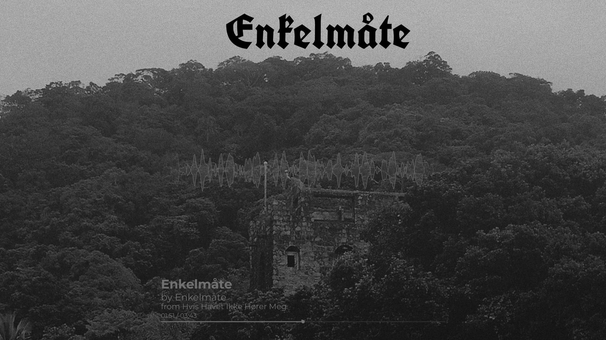
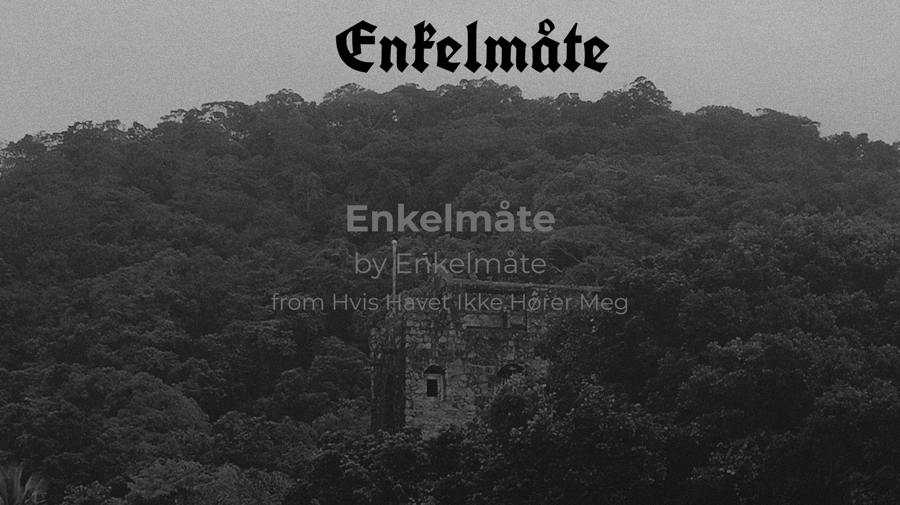
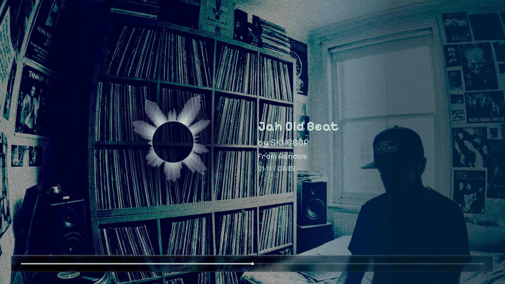
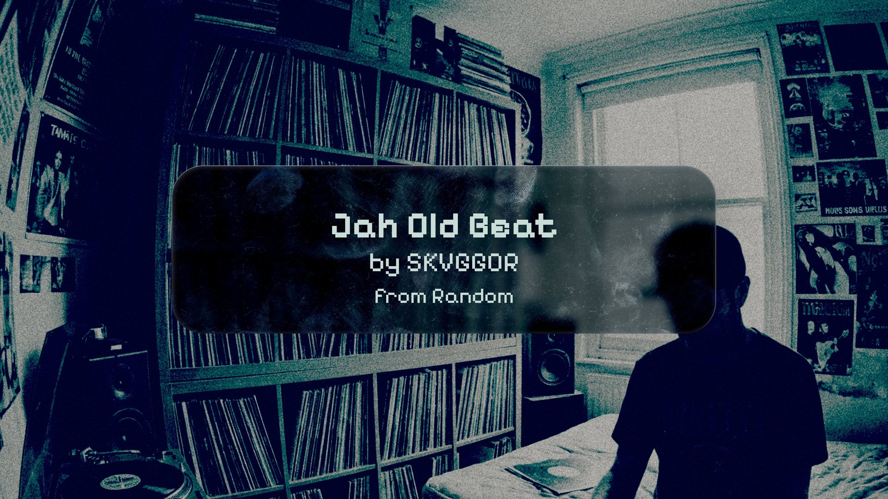

<p align="center">
  <br/>
 <h1 align="center">klangbild</h1>
</p>

Generate a **4K audio visualizer video** (MP4) and a matching **cover image** (JPG) from any MP3 file.

- Multiple layout options: classic, spotlight, split-left, split-right
- Two waveform styles: mirrored lines or radial/circular
- Background image rendered as-is, without any darkening overlay
- Song title, artist, album, and a seek bar positioned according to layout
- Staggered fade-in / fade-out (background → wave → UI)
- Infinite-wave edge fade effect (line style)
- GPU encoding via NVENC or VAAPI (optional)
- Parallel CPU frame rendering piped directly to FFmpeg (no temp files)
- Batch mode: process an entire folder of MP3s at once

---

## Examples

### Example 1: Classic + Line

| Video frame | Cover image |
|:-----------:|:-----------:|
|  |  |

*Enkelmåte — "Enkelmåte" from Hvis Havet Ikke Hører Meg*

### Example 2: Split-left + Circular

| Video frame | Cover image |
|:-----------:|:-----------:|
|  |  |

*SKVGGOR — "Jah Old Beat" from Random*

---

## Requirements

- Python ≥ 3.11
- [uv](https://github.com/astral-sh/uv) (package manager)
- FFmpeg ≥ 5 (must be in `$PATH`)
- For NVIDIA GPU encoding: NVENC-capable driver
- For Intel/AMD GPU encoding: Mesa VA-API

---

## Installation

```bash
git clone https://github.com/skvggor/klangbild.git
cd klangbild
uv sync
```

---

## Usage

### Single file

```bash
uv run python visualizer.py \
    --audio    "song.mp3" \
    --background "cover.jpg" \
    --title    "Song Title" \
    --artist   "Artist Name" \
    --album    "Album Name" \
    --color    "#FFFFFF" \
    --output   "visualizer.mp4"
```

`--title`, `--artist`, `--album` are optional (fall back to filename / empty string).

### Batch mode

Process every MP3 in a folder. Title, artist and album are read from each file's ID3 tags automatically.

```bash
uv run python visualizer.py \
    --input-dir "/path/to/mp3s" \
    --background "cover.jpg" \
    --color     "#FFFFFF" \
    --gpu       nvenc \
    --workers   30
```

Each MP3 produces a `.mp4` and `.jpg` in the same folder.

---

## Options

| Flag | Default | Description |
|------|---------|-------------|
| `--audio` | — | Path to MP3/WAV (single-file mode) |
| `--input-dir` | — | Folder of MP3s (batch mode) |
| `--background` | **required** | Background image path for video |
| `--cover-background` | same as `--background` | Separate background image for cover JPG |
| `--title` | filename stem | Song title |
| `--artist` | `""` | Artist name |
| `--album` | `""` | Album name |
| `--color` | `#FFFFFF` | Hex color (`#RGB` or `#RRGGBB`) |
| `--output` | `output.mp4` | Output path (single-file mode) |
| `--gpu` | `none` | `none` · `nvenc` · `vaapi` |
| `--workers` | cpu_count − 2 | Parallel render workers |
| `--font` | system DejaVu/Liberation | Regular font `.ttf/.otf` |
| `--font-bold` | system DejaVu Bold | Bold font `.ttf/.otf` |
| `--lang` | `en` | Prefix language: `en` (by/from) · `pt` (por/de) |
| `--layout` | `classic` | Visual layout (see below) |
| `--wave-style` | `line` | Waveform drawing style (see below) |
| `--smoothing-window` | `15` | Spatial waveform smoothing window |
| `--temporal-alpha` | `0.35` | Temporal EMA between frames (0=frozen, 1=raw) |

---

## Layouts

The `--layout` flag controls how elements are positioned on the 3840×2160 canvas.

| Layout | Description |
|--------|-------------|
| `classic` | Original layout. Waveform centred, text stacked below, seek bar at bottom. |
| `spotlight` | Large centred text with generous margins. Seek bar above text, waveform below. |
| `split-left` | Two-column layout. Waveform on the left, text on the right, full-width seek bar at bottom. |
| `split-right` | Two-column layout. Text on the left, waveform on the right, full-width seek bar at bottom. |

Reference layout images are included in `assets/`:

| Spec file | Description |
|-----------|-------------|
| `spec_classic_line.png` | classic + line waveform |
| `spec_classic_circular.png` | classic + circular waveform |
| `spec_spotlight_line.png` | spotlight + line waveform |
| `spec_spotlight_circular.png` | spotlight + circular waveform |
| `spec_split-left_line.png` | split-left + line waveform |
| `spec_split-left_circular.png` | split-left + circular waveform |
| `spec_split-right_line.png` | split-right + line waveform |
| `spec_split-right_circular.png` | split-right + circular waveform |
| `spec_cover.png` | cover image layout |

Each spec shows:
- Waveform area (blue for line, orange for circular)
- Text area (green)
- Seek bar (yellow)
- Dimensions and positions

---

## Wave Styles

The `--wave-style` flag controls how the waveform is drawn.

| Style | Description |
|-------|-------------|
| `line` | Classic mirrored waveform lines with fill. |
| `circular` | Radial waveform — bars project outward from a central ring. |

Both styles react to the audio in real-time. The circular style works best with spotlight layout.

---

## Output

- `<output>.mp4` — 3840×2160 (4K), 30 fps, H.264, AAC 320 kbps
- `<output>.jpg` — 4K cover image with centered text
