<p align="center">
  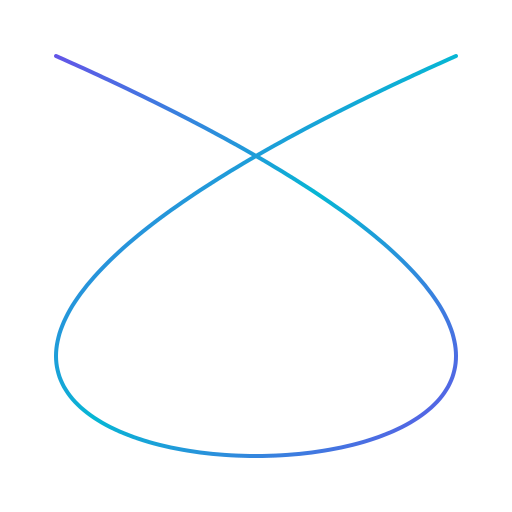<br/>
  <h1 align="center">klangbild</h1>
</p>

Generate a **4K audio visualizer video** (MP4) and a matching **cover image** (JPG) from any MP3 file.

---

## Table of Contents

1. [Features](#features)
2. [Examples](#examples)
3. [Requirements](#requirements)
4. [Installation](#installation)
5. [Usage](#usage)
6. [Options](#options)
7. [Resources](#resources)
   - [Layouts](#layouts)
   - [Wave Styles](#wave-styles)
   - [Gradients](#gradients)
   - [Film Grain](#film-grain)
 8. [Output](#output)
 9. [License](#license)

---

## Features

- Multiple layout options: classic, spotlight, split-left, split-right
- Two waveform styles: mirrored lines or radial/circular
- Background image rendered as-is, without any darkening overlay
- Song title, artist, album, and a seek bar positioned according to layout
- Staggered fade-in / fade-out (background → wave → UI)
- Infinite-wave edge fade effect (line style)
- GPU encoding via NVENC or VAAPI (optional)
- Parallel CPU frame rendering piped directly to FFmpeg (no temp files)
- Batch mode: process an entire folder of MP3s at once

---

## Examples

### Covers

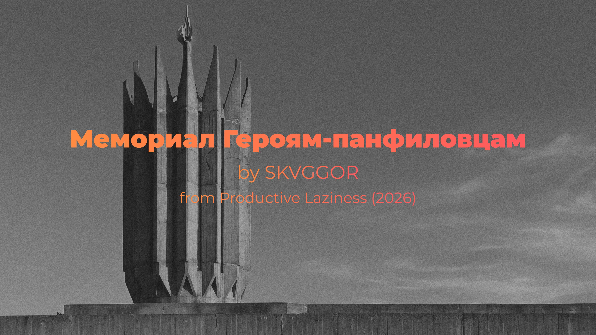

*SKVGGOR — "Мемориал Героям-панфиловцам"*

---

### Layouts

| Layout | Line Wave | Circular Wave |
|--------|:---------:|:-------------:|
| **Classic** | 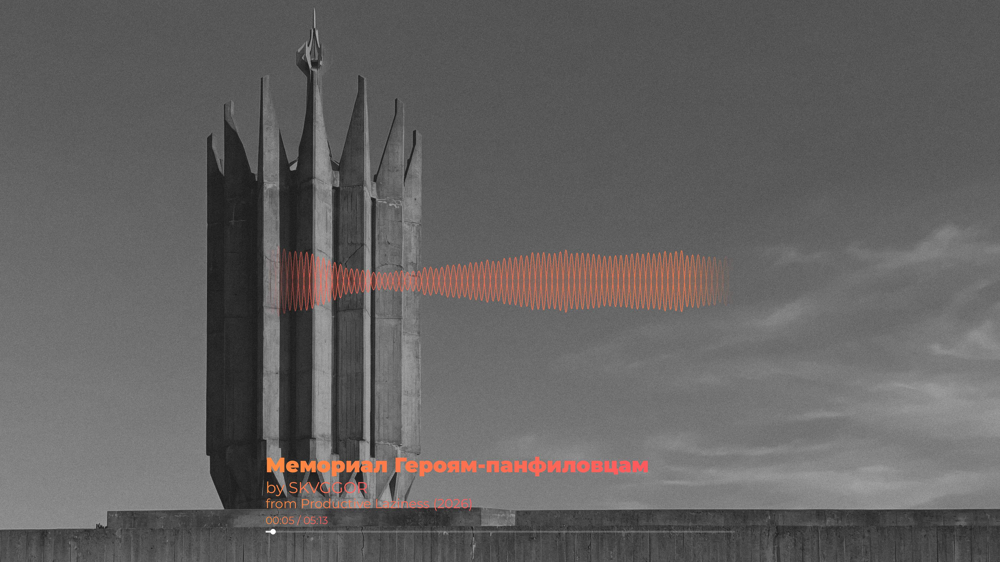 | 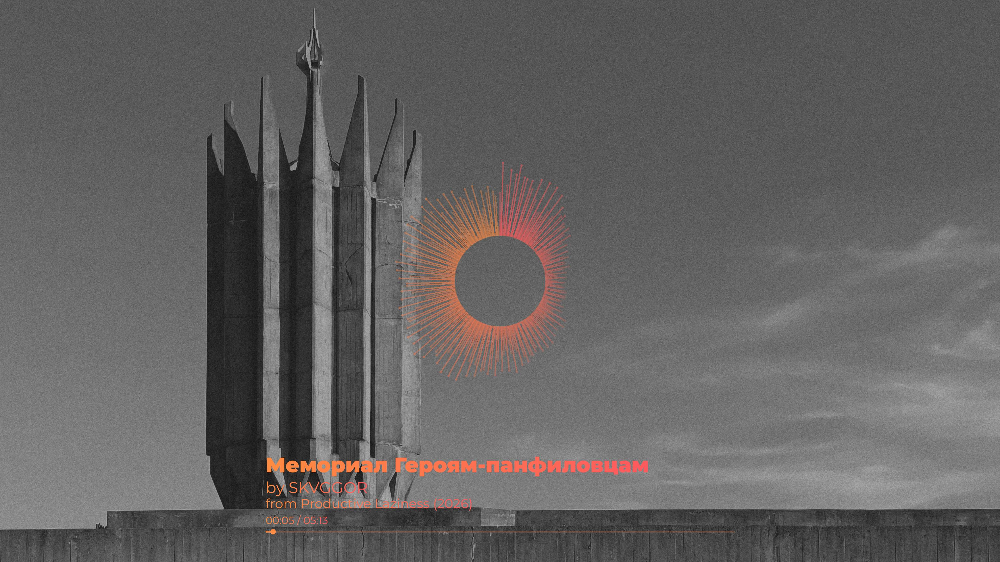 |
| **Spotlight** | 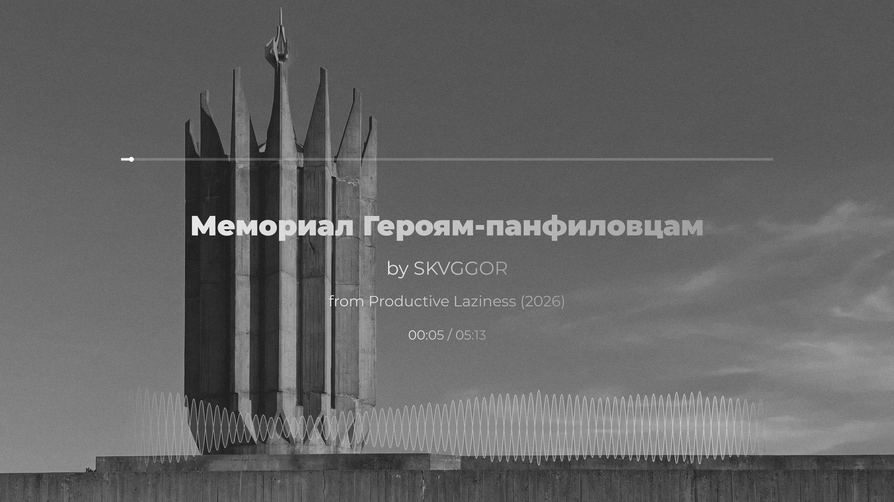 | 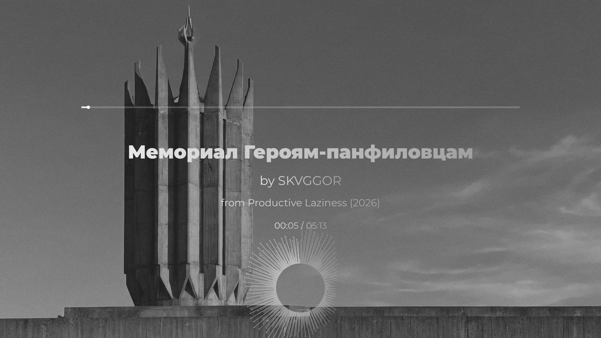 |
| **Split Left** | 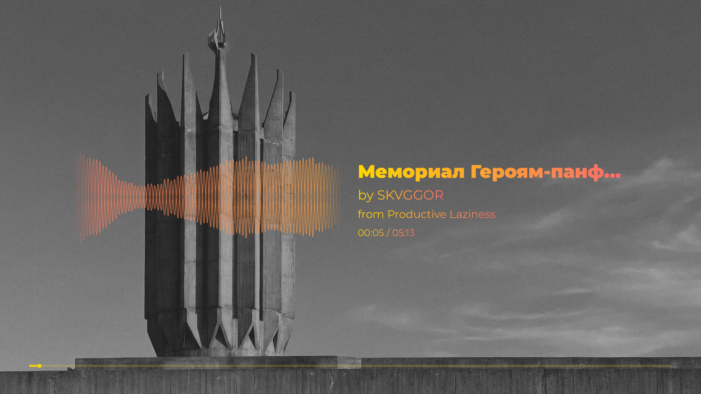 | 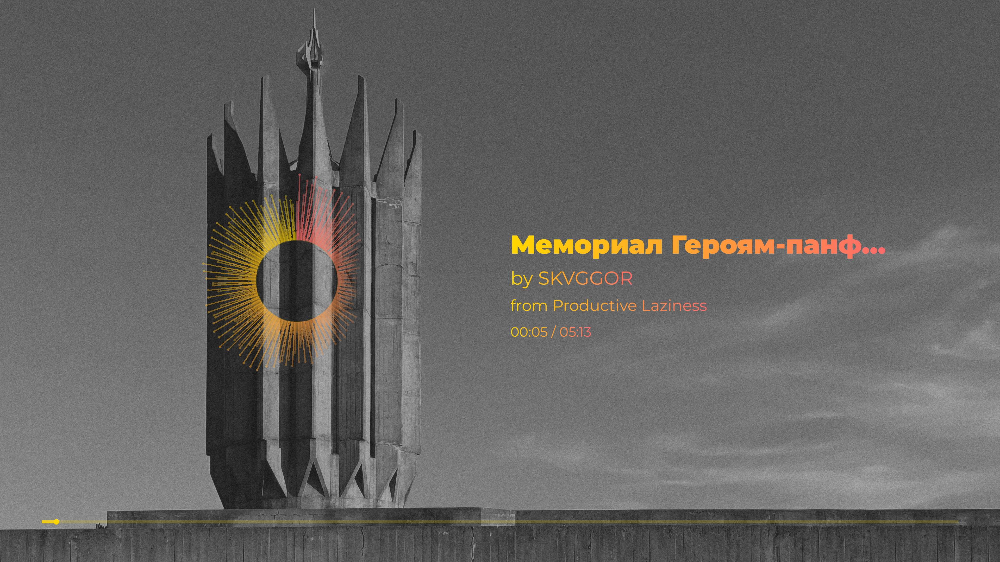 |
| **Split Right** | 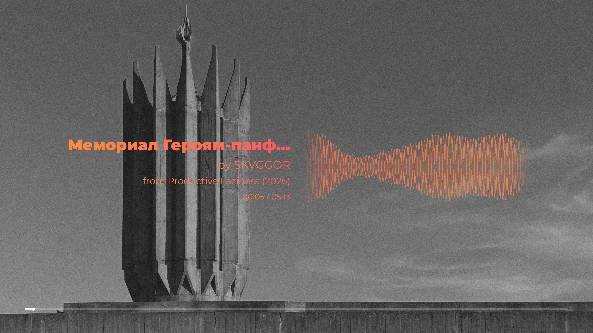 | 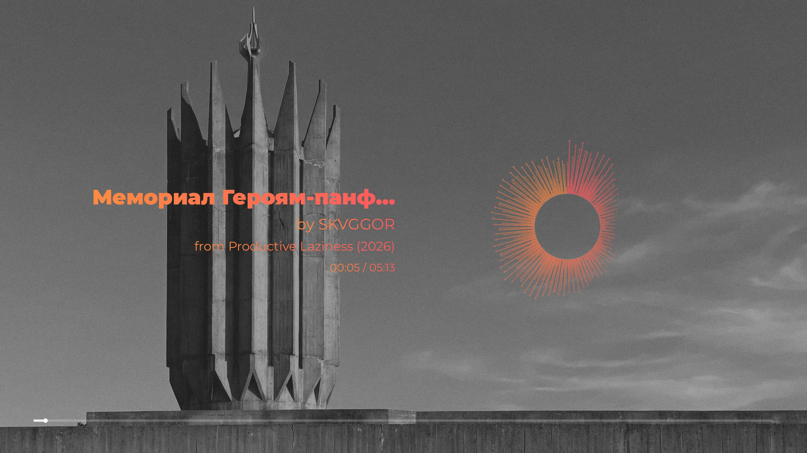 |

---

### Film Grain

| Low (0.08) | Medium (0.15) | High (0.25) |
|:----------:|:-------------:|:-----------:|
|  |  | 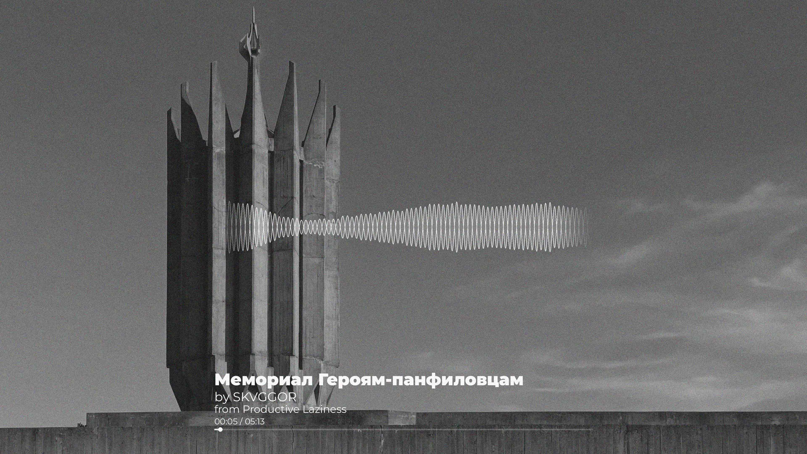 |

---

## Requirements

- Python ≥ 3.11
- [uv](https://github.com/astral-sh/uv) (package manager)
- FFmpeg ≥ 5 (must be in `$PATH`)
- For NVIDIA GPU encoding: NVENC-capable driver
- For Intel/AMD GPU encoding: Mesa VA-API

---

## Installation

```bash
git clone https://github.com/skvggor/klangbild.git
cd klangbild
uv sync
```

---

## Development

```bash
# Install dev dependencies
uv sync --group dev

# Set up pre-commit hooks (pre-commit and pre-push)
uv run pre-commit install
uv run pre-commit install --hook-type pre-push

# Run all checks manually
uv run pre-commit run --all-files
```

### Git Hooks

- **Commit**: ruff (lint + format)
- **Push**: mypy + pytest

### CI

Tests run automatically on PRs to `main` via GitHub Actions.

---

## License

## Usage

### Basic

```bash
uv run klangbild \
    --audio "song.mp3" \
    --background "cover.jpg" \
    --title "Song Title" \
    --artist "Artist Name" \
    --album "Album Name" \
    --output "visualizer.mp4"
```

### With Custom Font

```bash
uv run klangbild \
    --audio "song.mp3" \
    --background "cover.jpg" \
    --title "Song Title" \
    --artist "Artist Name" \
    --album "Album Name" \
    --font "Montserrat-Regular.ttf" \
    --font-bold "Montserrat-Black.ttf" \
    --output "visualizer.mp4"
```

### With Gradients

```bash
uv run klangbild \
    --audio "song.mp3" \
    --background "cover.jpg" \
    --layout spotlight \
    --wave-style circular \
    --text-gradient "#FF8C42,#FF5A5F" \
    --wave-gradient "#FF5A5F,#FF8C42" \
    --output "visualizer.mp4"
```

### With Film Grain

```bash
uv run klangbild \
    --audio "song.mp3" \
    --background "cover.jpg" \
    --grain 0.15 \
    --output "visualizer.mp4"
```

### With Portuguese Language

```bash
uv run klangbild \
    --audio "musica.mp3" \
    --background "capa.jpg" \
    --title "Título da Música" \
    --artist "Nome do Artista" \
    --album "Nome do Álbum" \
    --lang pt \
    --output "visualizer.mp4"
```

### Full Example

```bash
uv run klangbild \
    --audio "song.mp3" \
    --background "cover.jpg" \
    --title "Тыл — фронту" \
    --artist "SKVGGOR" \
    --album "Productive Laziness (2026)" \
    --layout spotlight \
    --wave-style circular \
    --text-gradient "#FFD700,#FF6B6B" \
    --wave-gradient "#FF6B6B,#FFD700" \
    --grain 0.1 \
    --font "Montserrat-Regular.ttf" \
    --font-bold "Montserrat-Black.ttf" \
    --gpu nvenc \
    --workers 30 \
    --output "visualizer.mp4"
```

### Batch Mode

```bash
uv run klangbild \
    --input-dir "/path/to/mp3s" \
    --background "cover.jpg" \
    --font "Montserrat-Regular.ttf" \
    --font-bold "Montserrat-Black.ttf" \
    --gpu nvenc \
    --workers 30
```

---

## Options

| Flag | Default | Description |
|------|---------|-------------|
| `--audio` | — | Path to MP3/WAV (single-file mode) |
| `--input-dir` | — | Folder of MP3s (batch mode) |
| `--background` | **required** | Background image path for video |
| `--cover-background` | same as `--background` | Separate background image for cover JPG |
| `--title` | filename stem | Song title |
| `--artist` | `""` | Artist name |
| `--album` | `""` | Album name |
| `--color` | `#FFFFFF` | Hex color (`#RGB` or `#RRGGBB`) |
| `--output` | `output.mp4` | Output path (single-file mode) |
| `--gpu` | `none` | `none` · `nvenc` · `vaapi` |
| `--workers` | cpu_count − 2 | Parallel render workers |
| `--font` | system DejaVu/Liberation | Regular font `.ttf/.otf` |
| `--font-bold` | system DejaVu Bold | Bold font `.ttf/.otf` |
| `--lang` | `en` | Prefix language: `en` (by/from) · `pt` (por/de) |
| `--layout` | `classic` | Visual layout (see below) |
| `--wave-style` | `line` | Waveform drawing style (see below) |
| `--text-gradient` | — | Gradient colors for text (see below) |
| `--text-gradient-dir` | `horizontal` | Text gradient direction: `horizontal` · `vertical` |
| `--wave-gradient` | — | Gradient colors for waveform (see below) |
| `--wave-gradient-dir` | `horizontal` | Waveform gradient direction: `horizontal` · `vertical` |
| `--grain` | `0.0` | Film-grain intensity: `0.0` (off) → `1.0` (heavy) |
| `--smoothing-window` | `15` | Spatial waveform smoothing window |
| `--temporal-alpha` | `0.35` | Temporal EMA between frames (0=frozen, 1=raw) |

---

## Resources

### Layouts

The `--layout` flag controls how elements are positioned on the 3840×2160 canvas.

| Layout | Description |
|--------|-------------|
| `classic` | Original layout. Waveform centred, text stacked below, seek bar at bottom. |
| `spotlight` | Large centred text with generous margins. Seek bar above text, waveform below. |
| `split-left` | Two-column layout. Waveform on the left, text on the right, full-width seek bar at bottom. |
| `split-right` | Two-column layout. Text on the left, waveform on the right, full-width seek bar at bottom. |

Reference layout images are included in `assets/`:

| Spec file | Description |
|-----------|-------------|
| `spec_classic_line.png` | classic + line waveform |
| `spec_classic_circular.png` | classic + circular waveform |
| `spec_spotlight_line.png` | spotlight + line waveform |
| `spec_spotlight_circular.png` | spotlight + circular waveform |
| `spec_split-left_line.png` | split-left + line waveform |
| `spec_split-left_circular.png` | split-left + circular waveform |
| `spec_split-right_line.png` | split-right + line waveform |
| `spec_split-right_circular.png` | split-right + circular waveform |
| `spec_cover.png` | cover image layout |

Each spec shows:
- Waveform area (blue for line, orange for circular)
- Text area (green)
- Seek bar (yellow)
- Dimensions and positions

### Wave Styles

The `--wave-style` flag controls how the waveform is drawn.

| Style | Description |
|-------|-------------|
| `line` | Classic mirrored waveform lines with fill. |
| `circular` | Radial waveform — bars project outward from a central ring. |

Both styles react to the audio in real-time. The circular style works best with spotlight layout.

### Gradients

Both text and waveform support independent color gradients. Each flag accepts two or more `#RGB` or `#RRGGBB` values separated by commas.

```bash
# Text gradient only
uv run klangbild \
    --audio "song.mp3" --background "cover.jpg" \
    --text-gradient "#FF8C42,#FF5A5F"

# Waveform gradient only
uv run klangbild \
    --audio "song.mp3" --background "cover.jpg" \
    --wave-gradient "#FFD700,#FF6B6B"

# Both combined, vertical direction
uv run klangbild \
    --audio "song.mp3" --background "cover.jpg" \
    --text-gradient "#FF8C42,#FF5A5F" --text-gradient-dir vertical \
    --wave-gradient "#FFD700,#FF6B6B" --wave-gradient-dir vertical

# Three-stop gradient
uv run klangbild \
    --audio "song.mp3" --background "cover.jpg" \
    --text-gradient "#FF0000,#FFFFFF,#0000FF"
```

When `--text-gradient` is provided it overrides `--color` for all text elements and for the seek bar. When `--wave-gradient` is provided it overrides `--color` for the waveform. If only `--wave-gradient` is set (no text gradient), the seek bar also picks its color from the wave gradient. Both flags are independent and can be combined freely.

**Direction:**

| Value | Text | Waveform (`line`) |
|-------|------|-------------------|
| `horizontal` *(default)* | left → right across each glyph | left → right across the wave |
| `vertical` | top → bottom across each glyph | top → bottom across the wave |

For the `circular` waveform style the gradient direction flag is ignored — colors cycle angularly around the ring instead.

### Film Grain

The `--grain` flag overlays animated film grain on every frame. The value is a float between `0.0` (no grain) and `1.0` (heavy grain). At `0.0` the effect is completely skipped with no performance cost.

```bash
# Subtle grain
uv run klangbild \
    --audio "song.mp3" --background "cover.jpg" \
    --grain 0.08

# Noticeable grain
uv run klangbild \
    --audio "song.mp3" --background "cover.jpg" \
    --grain 0.25
```

Each frame uses a unique random seed so the grain animates naturally without repeating patterns.

---

## Output

- `<output>.mp4` — 3840×2160 (4K), 30 fps, H.264, AAC 320 kbps
- `<output>.jpg` — 4K cover image with centered text

---

## License

[GNU General Public License v3.0](LICENSE)
